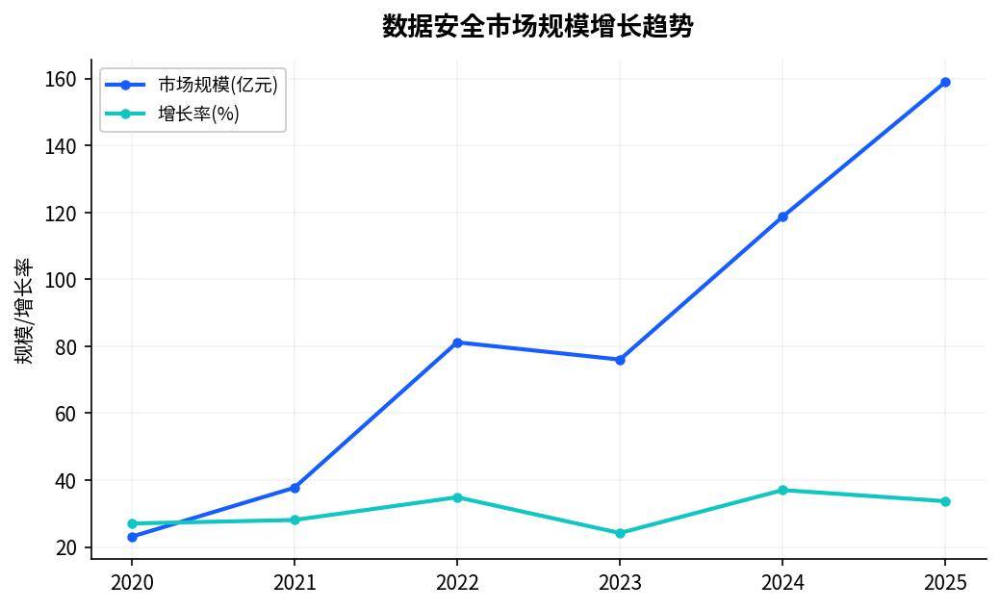
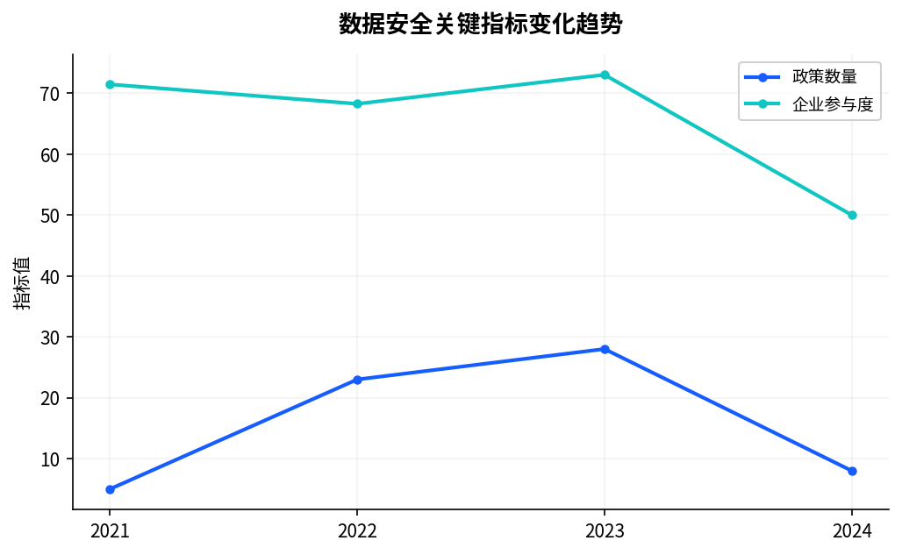

# 零信任安全架构在数据保护中的应用

> 从边界防护到持续验证的范式转换

| 信息项 | 内容 |
|-------|------|
| 发布日期 | 2024-06-20 |
| 研究领域 | 数据安全 |
| 关键词 | 零信任, 安全架构, 身份认证 |
| 作者 | 查特查特科技行业研究中心 |

## 摘要

在日趋复杂的网络安全态势下，数据安全已成为国家安全的重要组成部分。本报告围绕零信任、安全架构、身份认证等重点领域，全面评估当前安全威胁形势、技术防护能力与合规建设进展，为安全治理体系建设提供分析支撑。

## 一、研究背景与目的

### 1.1 研究背景

2024年，数据安全领域迎来了重要的发展节点。从政策层面看，国家持续出台系列指导文件，为行业发展提供明确的制度框架与政策导向。从技术层面看，零信任、安全架构、身份认证等核心技术取得显著进展，工程化成熟度不断提升。从市场层面看，越来越多的行业场景开始规模化应用相关技术方案，产业生态日趋完善。

当前，数字经济已成为推动经济增长的重要引擎。据统计，2024年我国数字经济规模预计突破56万亿元，占GDP比重超过42%。在此背景下，数据安全的战略价值进一步凸显，成为各方竞相布局的重点领域。

### 1.2 研究目的

本报告旨在系统梳理数据安全领域的最新进展，重点分析零信任、安全架构、身份认证等方向的技术演进、应用实践与发展趋势，为决策者提供全局性的认知框架与行动参考。

## 二、行业发展现状

### 2.1 政策环境

在政策层面，近年来围绕数据安全的制度供给持续加强。从中央到地方，已形成较为完整的政策体系：

- 国家层面：多部委联合发文，从顶层设计角度明确数据安全的发展方向与重点任务
- 行业层面：金融、医疗、政务等重点领域出台专项指导意见，推动技术标准与规范建设
- 地方层面：北京、上海、广东、浙江等数字经济先发地区先行先试，形成可复制推广的经验

### 2.2 市场规模

据行业研究机构统计，2024年中国数据安全市场规模达到约252亿元，同比增长32%。其中，金融行业仍是最大的应用市场，占比约35%；政务领域增速最快，年增长率超过49%。

从区域分布看，长三角、京津冀和粤港澳大湾区是三大核心市场，合计占全国市场份额的80%以上。

## 三、核心技术分析

### 3.1 技术发展脉络

数据安全的技术发展经历了从理论探索到工程落地的演进过程。在零信任、安全架构、身份认证等方向，2024年取得了以下重要进展：

**技术成熟度提升**：核心算法的工程化实现日趋完善，性能指标持续优化。以隐私计算为例，千万级数据规模的处理效率已从小时级提升至分钟级，为大规模商业化应用奠定了基础。

**标准化进程加速**：行业标准的制定与发布明显提速，国家标准、行业标准与团体标准形成多层次的标准体系，为技术互联互通与产品评测认证提供了依据。

**开源生态活跃**：国内外开源社区持续贡献高质量的技术实现，降低了技术门槛，加速了创新扩散。

*图1: 数据安全行业分析*

### 3.2 关键技术指标

| 指标维度 | 当前水平 | 发展趋势 |
|---------|---------|---------|
| 计算效率 | 千万级数据32秒处理 | 持续优化，向亿级突破 |
| 安全强度 | 128位密钥安全 | 后量子密码迁移推进 |
| 部署成本 | 较三年前降低50% | 容器化与云原生持续降本 |
| 易用性 | 可视化配置覆盖70%场景 | 低代码化趋势明显 |

## 四、典型应用场景与实践

### 4.1 金融行业

金融行业是数据安全技术应用最为成熟的领域。在信用评估、反欺诈、反洗钱等场景中，隐私计算技术已从POC验证进入规模化生产阶段。多家头部银行与金融科技公司建立了跨机构联合建模能力，在不共享原始数据的前提下实现了风控模型AUC指标3%以上的提升。

### 4.2 医疗健康

医疗数据的敏感性使其成为隐私保护技术的典型应用场景。跨院区的临床数据协同分析、药物研发中的多方数据联合建模、医疗影像的联邦学习等方向均取得实质性进展。尤其在传染病防控、罕见病研究等公共卫生领域，隐私保护下的数据共享为科研突破提供了重要支撑。

### 4.3 政务治理

数字政府建设推动政务数据的跨部门、跨层级共享需求持续增长。通过联邦查询等技术手段，在保障数据安全边界的前提下实现了公安、社保、税务等多部门数据的联合分析，为基层治理、综合研判与公共服务优化提供了数据支撑。

## 五、挑战与发展建议

*图2: 数据安全关键趋势指标*

### 5.1 当前挑战

尽管数据安全领域取得了显著进展，但仍面临以下核心挑战：

1. **技术与业务的匹配度不足**：部分技术方案在实验环境表现优异，但在真实业务场景中面临数据质量、系统集成、运维复杂度等问题
2. **标准体系有待完善**：技术标准与业务标准的衔接不够紧密，跨平台互联互通能力不足
3. **复合型人才短缺**：兼具密码学、机器学习、系统工程与行业知识的复合型人才供给严重不足
4. **商业模式探索中**：从技术能力到商业价值的转化路径尚不清晰，可持续的盈利模式仍在探索

### 5.2 发展建议

针对上述挑战，提出以下发展建议：

- **强化顶层设计**：完善法律法规与标准规范，为技术应用提供清晰的合规边界
- **推进技术攻关**：在高性能密码学算法、大规模联邦计算引擎等方向持续投入研发
- **深化场景落地**：以金融、医疗、政务等关键行业为突破口，建立可复制的标杆案例
- **构建人才体系**：加强高校学科建设与产教融合，培养多层次的专业人才队伍
- **推动生态建设**：通过开源协作、产业联盟等方式，构建开放共赢的产业生态

## 六、发展展望

展望未来，数据安全领域将呈现以下发展趋势：

**技术融合加速**：隐私计算与人工智能、区块链、云计算等技术的深度融合将催生新的技术范式与应用场景。特别是大模型时代的到来，为隐私保护下的智能服务提供了广阔空间。

**应用规模化**：随着技术成熟度提升与成本持续下降，数据安全应用将从头部机构向中小企业延伸，从重点行业向更多领域拓展，市场规模有望保持45%以上的年均增速。

**治理体系完善**：全球范围内的数据治理制度将持续演进，中国作为数据大国，在制度建设与技术标准方面的国际影响力将进一步提升。

**产业生态成熟**：从基础技术到应用平台，从咨询服务到运营支撑，完整的产业链条将逐步形成，为数据要素的安全高效流通提供全方位的支撑体系。

---

*本报告由查特查特科技行业研究中心撰写发布，仅供行业参考与学术交流使用。*
